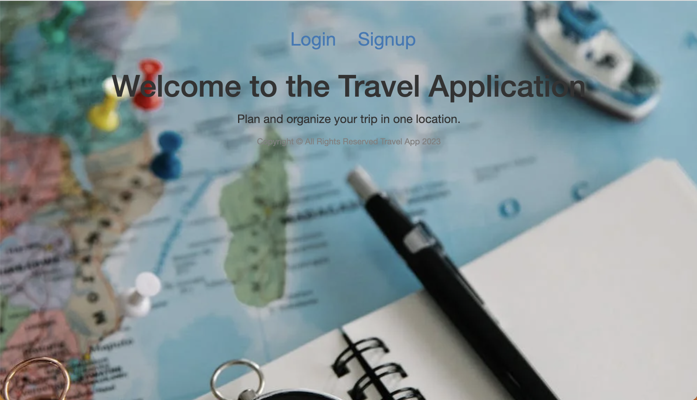
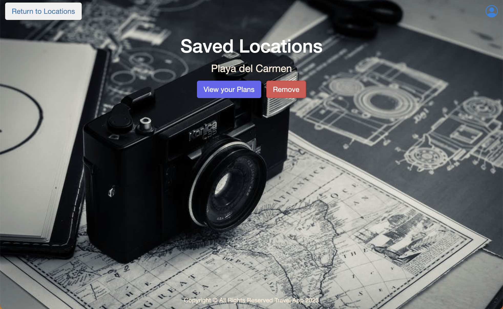

#<u> Travel App </u>

### A web applicaiton that a users can add destinations they are traveling to and plan their trip. 

##Technologies Used

1. Express
2. Mongoose
3. MongoDb
4. EJS
5. JavaScript
6. jQuery
7. CSS3
8. Node.js

##Application Screenshots

## Getting Started
* Please create an account if you have not done so.
    * Once account is created you can view the site.
    * Can add locations you have traveled to. 
    * Important! Anyone can view added locations so be mindful of what you put.
    * Can view individual places and add them to your saved list.
    * On saved list you can plan out your trip.
    * Only you can view your planned list

Click here to visit[LINK](https://travel-app-1.herokuapp.com/)

##Future Enhancemenets 
* Ability for users to remove plans that have been added
* Disable save button once user has added location to their saved list
* Upload photo files instead of URLs
* Add mobile design 
