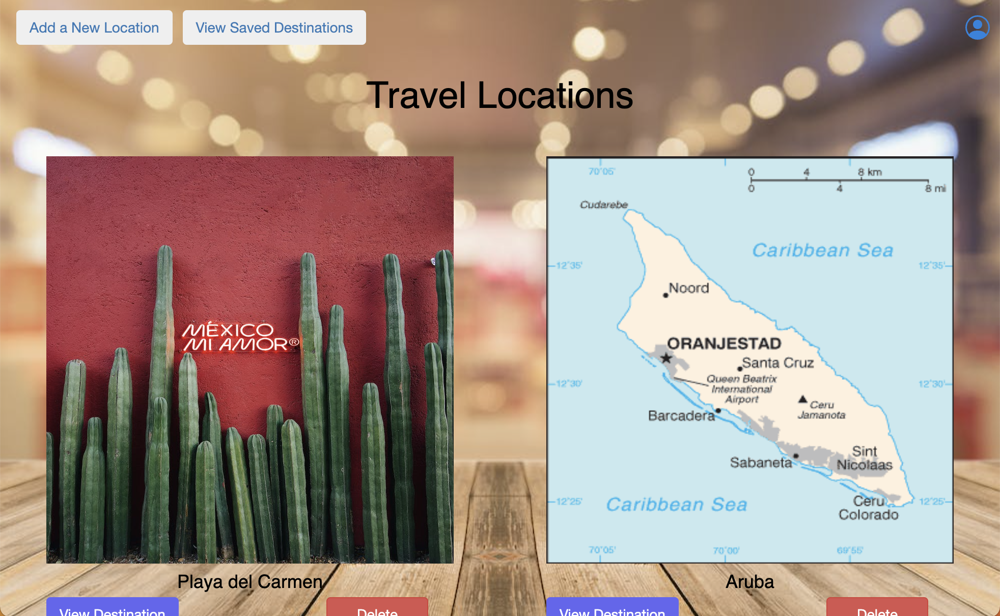

# <u> Travel App </u>

### A web application that users can create destinations they have traveled or will travel to. Users can add local attractions or hotels they haved visited. Note any user will be able to see these locations! To add plans about your trip please save the location first. Plans added under saved locations are not viewable by other users.

## Technologies Used

1. Node.js 
2. Mongoose
3. MongoDb
4. JavaScript
5. jQuery 
6. CSS3
7. EJS
8. Express
9. Bootstrap
10. Weather API

## Application Screenshots

## Getting Started
* Please create an account if you have not done so.
    * Once account is created you can view the site.
    * Important! Anyone can view added locations so be mindful of what you put.
    * On saved list you can plan out your trip.
    * Only you can view your planned list

Click here to visit[LINK](https://travel-app-1.herokuapp.com/)

## Future Enhancemenets 
* Ability for users to remove plans that have been added
* Disable save button once user has added location to their saved list
* Add Flights API
* Upload photo files instead of URLs
* Add mobile design 
